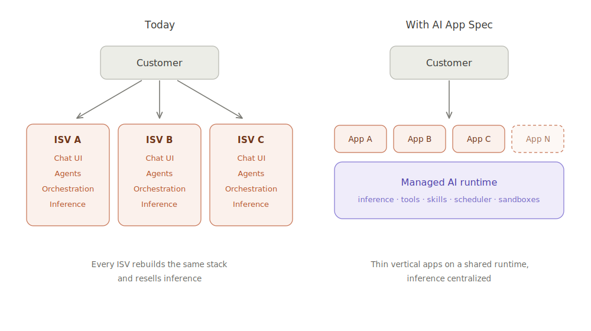

# AI App Spec

An open specification for packaging and deploying AI applications to managed AI runtimes.

## The problem

Every company building an AI application is assembling much of the same stack: model access, agent instructions, tools, permissions, sandboxed execution, background jobs, lifecycle management, and observability. Application vendors package that stack behind their own UI and operating model, even when their differentiated value is a domain-specific workflow.

This fragmentation is costly for everyone:

- **End-user teams** must evaluate, integrate, secure, and govern a growing collection of AI vendors. Each new use case brings another runtime, identity boundary, data path, and inference contract.
- **AI application runtime providers** offer increasingly capable primitives, but lack a standard deployable unit that lets an ecosystem compose those primitives into complete products.
- **Independent software vendors (ISVs)** repeatedly build undifferentiated infrastructure instead of concentrating on domain expertise, workflow design, and customer outcomes.

Customers who want to consolidate on a governed AI platform are left with two poor choices: build each application themselves or commission a bespoke implementation. What is missing is a third option: an ecosystem of vendor-supported applications that install into the platform customers already trust.

## The vision

An AI app should be a portable, versioned package that declares everything a compatible runtime needs to instantiate useful behavior.

An app package might compose packaged agent implementations and skills, tool integrations, permissions, schedules, execution requirements, data and secret bindings, lifecycle hooks, and observability metadata. It identifies implementation bytes without reproducing their internal agent or deployment logic; the runtime determines how to execute them securely and reliably using its native capabilities.

The AI App Spec defines the contract between those two sides. It is not a new runtime and does not prescribe how providers implement one. It establishes a common unit that can be validated, installed, configured, upgraded, and removed across compatible runtimes.

<picture>
  <source media="(prefers-color-scheme: dark)" srcset="assets/diagram/ai-native-apps-dark.svg">
  <source media="(prefers-color-scheme: light)" srcset="assets/diagram/ai-native-apps-light.svg">
  
</picture>

The result is a different way to deliver applied AI:

- **End-user teams** install specialized applications into a runtime they already trust. They retain a consistent control plane for identity, permissions, data access, auditability, inference, and cost.
- **Runtime providers** gain a distribution surface for complete applications. They can compete on execution quality, safety, governance, models, and developer experience while supporting a shared packaging contract.
- **ISVs** ship their domain expertise as a repeatable product instead of rebuilding an agent platform or delivering one-off services. They can focus on the last mile: workflows, integrations, evaluation, adoption, and change management.

In this model, runtime providers supply the horizontal platform, ISVs supply vertical and functional specialization, and customers can adopt both without accepting a new infrastructure silo and vendor for every use case.

## Why an open specification

AI application packaging should be an interoperability boundary, not a source of lock-in.

An open specification gives customers confidence that applications are inspectable and portable. It gives ISVs a stable target with access to multiple distribution channels. It gives runtime providers a common ecosystem surface while preserving ample room to differentiate in how applications are executed.

Portability does not require reducing every runtime to the lowest common denominator. The specification should define a useful common core, explicit capability negotiation, and namespaced provider extensions. An app can be broadly portable where the ecosystem agrees and intentionally provider-specific where it benefits from unique runtime capabilities.

Earlier platform shifts had analogous deployable units: application archives for app servers, Helm charts for Kubernetes, and managed packages for SaaS platforms. AI runtimes need their own unit of composition. Protocols such as MCP make tools available to models; the AI App Spec describes how tools and other resources form an installable application.

## Design principles

- **Declarative and versioned.** A package is reviewable, reproducible, and safe to upgrade or roll back.
- **Portable and extensible.** A common core supports interoperability without preventing provider innovation.
- **Governed by the runtime.** Packages declare requirements; runtimes enforce identity, permissions, isolation, policy, and resource limits.
- **Composable.** Apps assemble existing resources and capabilities rather than embedding another proprietary runtime.
- **Useful end to end.** The specification covers the lifecycle required to deploy and operate an app, not merely describe one.
- **Ecosystem-owned.** The format evolves in the open with input from users, runtime providers, and ISVs.

## What success looks like

A team can discover an AI app, inspect what it requires, and deploy it to its chosen runtime with a single consistent workflow. The runtime can validate the package, bind it to governed resources, and operate it using native infrastructure. The ISV can publish a new version without maintaining a separate agent stack for every provider or customer.

Installing specialized AI capability should become an (easy) deployment decision.

## Project status

AI App Spec is an early proposal. The first milestone is intentionally small, consisting of a minimal schema, a handful of useful example apps, and a reference CLI demonstrating deployment through a provider-neutral runtime interface. The goal is to make the contract concrete, learn from working implementations, and develop the specification in public.

## Further reading

- [Concepts: AI applications, packages, and runtimes](docs/concepts.md)
- [Packaging agent implementations](docs/packaging.md)
